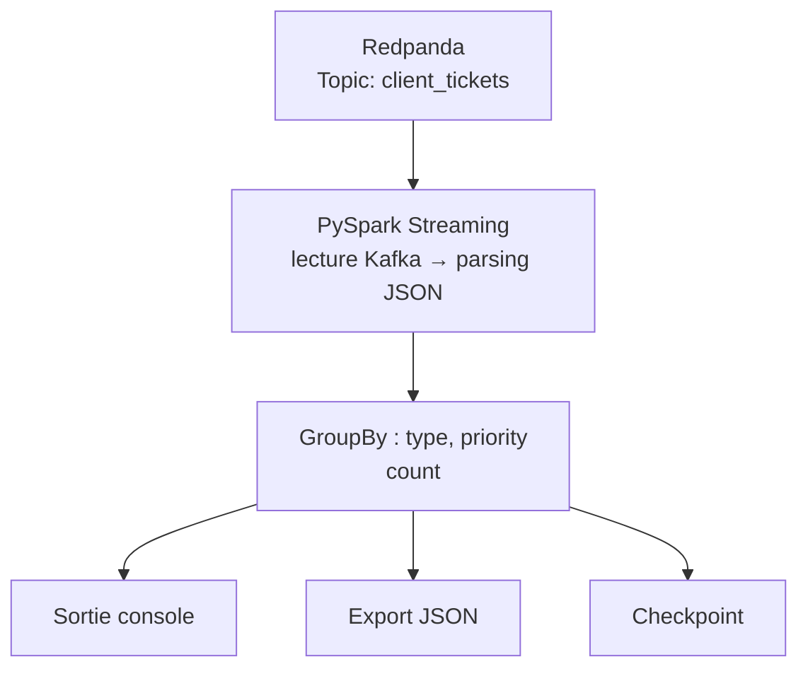

# Pipeline de Données Temps Réel – Redpanda + Spark Structured Streaming

### Proof of Concept — Pipeline de streaming temps réel avec Python, Redpanda et Apache Spark

##  Présentation

Ce projet illustre la mise en place d’un **pipeline de traitement de données en temps réel**, entièrement conteneurisé avec Docker.
Il combine plusieurs briques technologiques modernes :

* **Redpanda** → Broker de messages Kafka-compatible, léger et performant
* **Producteur Python** → Génération de tickets clients simulés (via `faker`)
* **Apache Spark Structured Streaming** → Lecture continue et agrégation en temps réel
* **Redpanda Console** → Interface web de visualisation des topics et des messages

L’objectif est de démontrer comment **produire**, **consommer** et **traiter** des flux de données en temps réel de bout en bout, dans une architecture reproductible et simple à déployer.

---

##  Description du Pipeline

1. **`tickets-generator`**
   Génère en continu des tickets clients factices envoyés au topic `client_tickets` :

   ```json
   {
     "ticket_id": 1452,
     "client_id": 9743,
     "created_at": "2025-10-14T09:25:43",
     "request": "Je ne peux plus accéder à mon compte.",
     "type": "support",
     "priority": "haute"
   }
   ```

2. **`spark-stream`**
   Lit les messages du topic et calcule en temps réel :

   * le nombre de tickets par `type` et `priority`,
   * ignore les messages malformés sans bloquer le flux,
   * exporte les agrégations :

     * dans la **console Spark**,
     * dans un **fichier JSON** mis à jour en continu.

3. **`redpanda-console`**
   Permet de visualiser les topics et messages à l’adresse :
   👉 [http://localhost:8080](http://localhost:8080)

---

## Diagramme des flux de données


--- 

## Démarrage avec Docker

### 1. Lancer l’environnement

```bash
docker compose up -d
```

### 2. Vérifier les logs

```bash
docker logs -f tickets-generator
docker logs -f spark-stream
```

### 3. Ouvrir la console Redpanda

[http://localhost:8080](http://localhost:8080)

---


## Vidéo de présentation et de démonstration du pipeline
https://youtu.be/QhyixvDcppk


##  Structure du projet

```
.
├── docker-compose.yml
├── .env
├── redpanda/
│   └── Dockerfile
├── generator/
│   ├── Dockerfile
│   └── tickets_generator.py
├── spark/
│   ├── Dockerfile
│   └── pyspark_stream_tickets.py
├── output/
│   └── aggregations/   # Sorties JSON du flux Spark
└── README.md
```

---

##  Exemple de sortie

### Agrégations en console :

```
+------------+----------+-----+
|type        |priority  |count|
+------------+----------+-----+
|support     |haute     | 124 |
|technique   |normale   |  87 |
|facturation |basse     |  42 |
|commercial  |critique  |  15 |
+------------+----------+-----+
```

### Fichier JSON généré :

```json
{"type":"support","priority":"haute","count":124}
{"type":"technique","priority":"normale","count":87}
{"type":"facturation","priority":"basse","count":42}
{"type":"commercial","priority":"critique","count":15}
```

---

## Résilience et gestion des erreurs

- Tolérance aux messages JSON invalides
- Aucune interruption du flux en cas d’erreur
- Checkpointing Spark activé pour reprise automatique
- Reprise automatique du streaming après redémarrage du conteneur